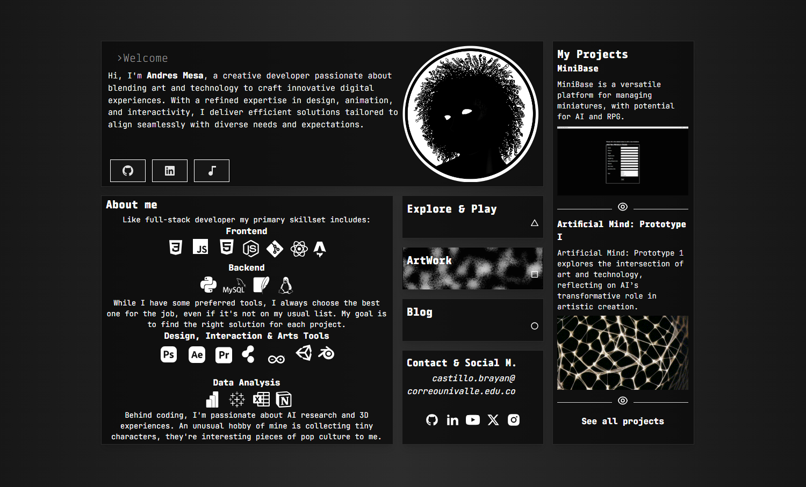

# blackars-website

## A portfolio website made using `Astro`.



## Created on the template "astro-bento-portfolio" made by Gianmarco Cavallo. Visit your work: https://github.com/ladvace


## Tech Stack

- [Astro](https://astro.build)
- [unocss](https://unocss.dev/)
- [motion](https://motion.dev/)
- [d3](https://d3js.org/)

# Steps ▶️

```bash
# Clone this repository
$ git clone https://github.com/blackars/blackars-website
```

```bash
# Go into the repository
$ cd blackars-website
```

```bash
# Install dependencies
$ pnpm install
or
$ npm install
```

```bash
# Start the project in development
$ pnpm run dev
or
$ npm run dev
```

# Deploy on Netlify 🚀

Deploying your website on Netlify it's optional but I reccomand it in order to deploy it faster and easly.

You just need to fork this repo and linking it to your Netlify account.

or

[](https://app.netlify.com/start/deploy?repository=https://github.com/Ladvace/astro-bento-portfolio)
