Technologies: Python and SQLite, frameworks such as Tkinter, Pandas, and Pillow

**MiniBase v1.0.0: Dynamic Management of Miniature Collectibles with Potential for AI and RPG.**

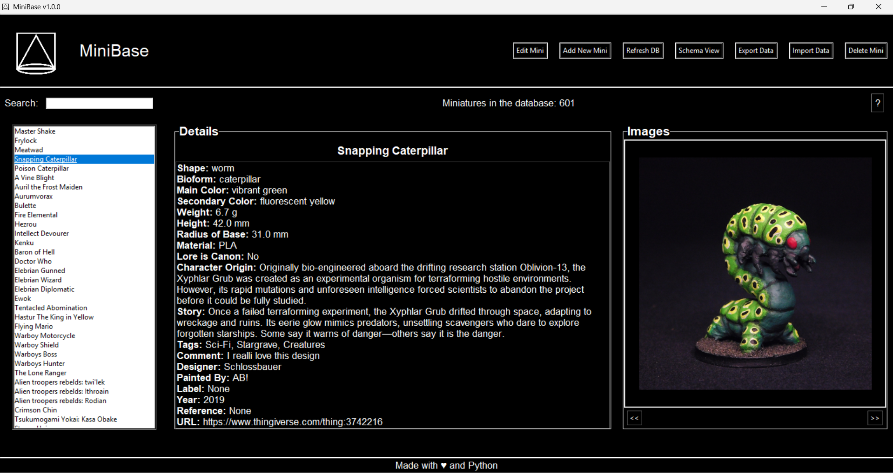

* **[ Here is the project code](https://github.com/blackars/MiniBase)**
* **[ & here an executable for Windows 10/11](https://github.com/blackars/MiniBase-Distro)**

The project begins with MiniBase, an innovative tool designed for collectors,creators, and miniature enthusiasts. Its primary goal is to provide a centralized platform for managing a database of miniatures, including visual details, metadata, and narrative and/or collectible lore. However, its modular and extensible design opens the door to future integrations with Artificial Intelligence models, making it an ideal solution for adding dynamism and depth to character collections in role-playing game (RPG) environments.

**Project Utility**

* Centralized Management: The application allows users to organize and maintain a detailed record of their miniatures, including physical attributes (such as weight, height, and colors) and narrative aspects (such as history and purpose within the user's or character's universe).

* Visualization and Organization: With the ability to upload images and detailed views, users can clearly and attractively visualize their miniatures, making it easier to organize large collections.

* Interoperability: The import and export functionality in formats such as JSON, Excel, and CSV allows data integration with other tools or platforms, making it ideal for collaborative projects or expansions.

* AI Readiness: The project's data structure is designed to be compatible with AI models. This means that, in the future, algorithms could be implemented to generate automatic descriptions, create dynamic stories, or even simulate character behaviors in RPG environments using Computer Vision tools.

* RPG Dynamism: By integrating lore and metadata, the database can serve as a key resource for Dungeon Masters or storytellers in a variety of role-playing games. Characters can be selected, customized, and used in campaigns, adding a unique level of immersion.

**System Operation** 

MiniBase is based on an intuitive graphical interface developed with Tkinter, which guides the user through the following main functionalities.

**Miniature Creation**

Users can add new miniature to the database, specifying attributes such as name, tags, materials, colors, etc., all in the creation module (creation_module.py).

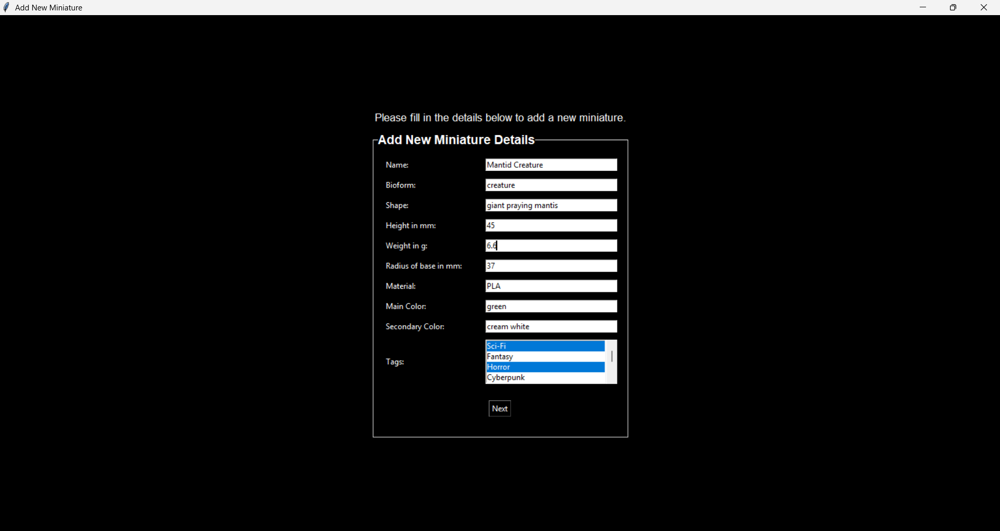
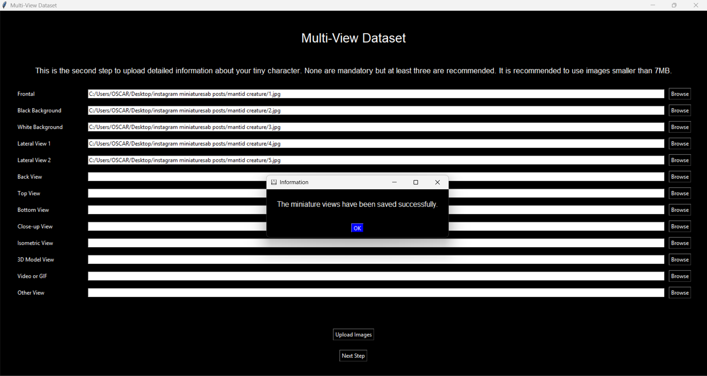
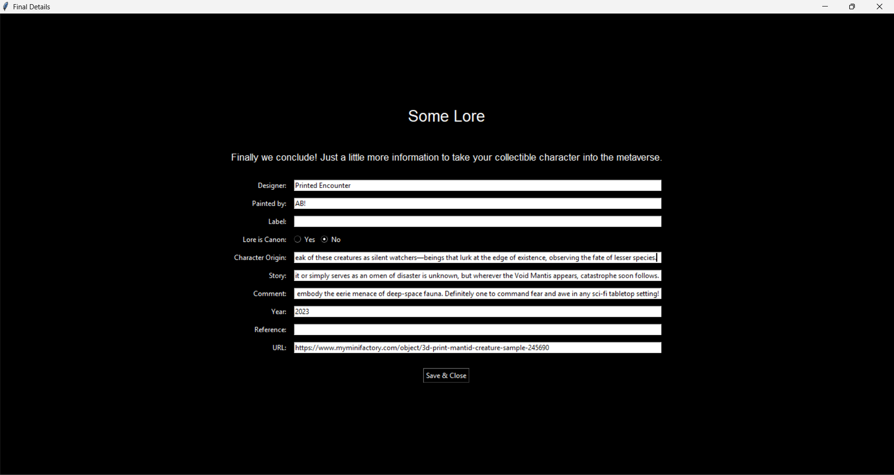

**Data Importation**

The import module (importation_module.py) requires a unified table structure that is provided in the Excel template (template.xlsx) and is the only one currently that supports the MiniBase system for importing data, and from which the first collectibles management was born.

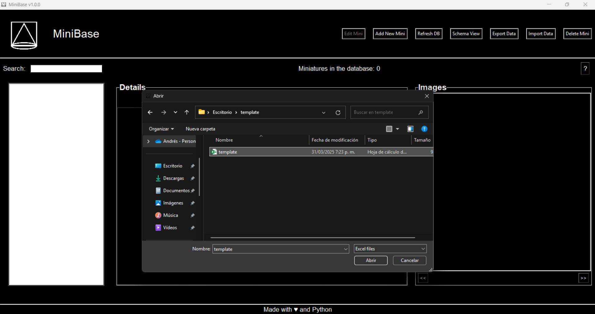
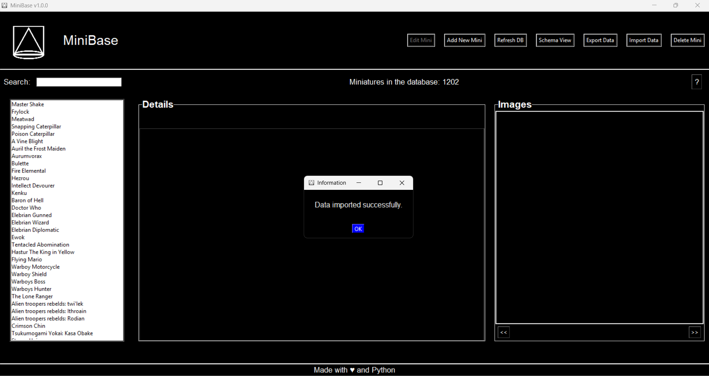
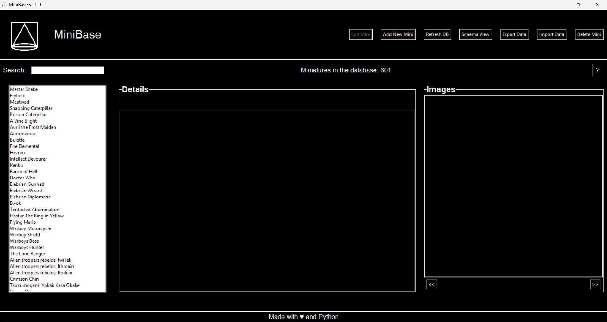

**Data Exportation** 

The export module (exportation_module.py) allows the entire database to be exported in three standard formats: CSV, JSON, and Excel File. This allows for use on other platforms or tools.

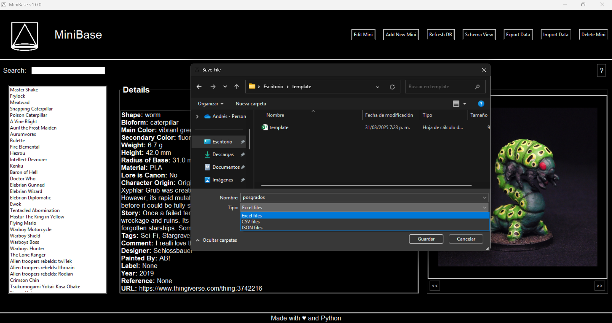

**Miniature Edition** 

Once the characters have been entered into the database, you can edit their details again, add missing ones, or replace images from the editing module (edition_module.py).

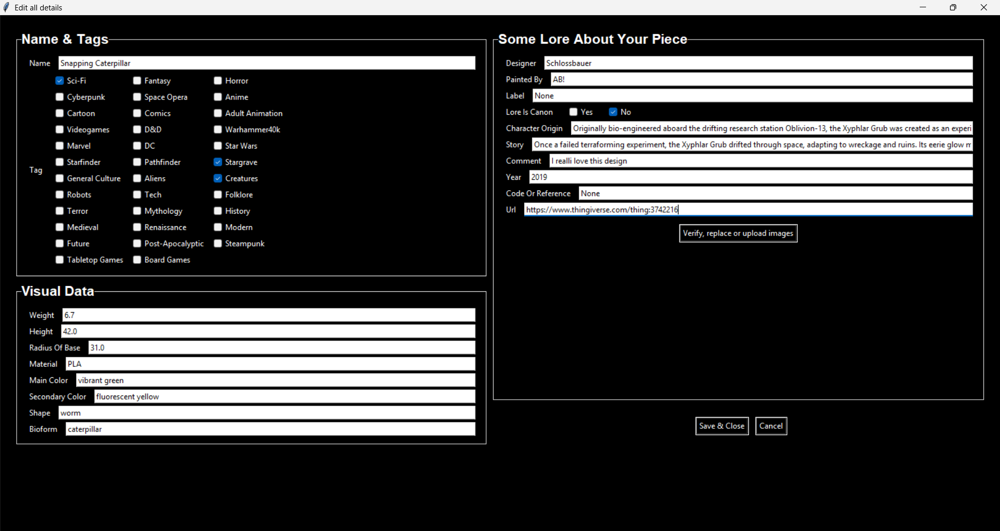
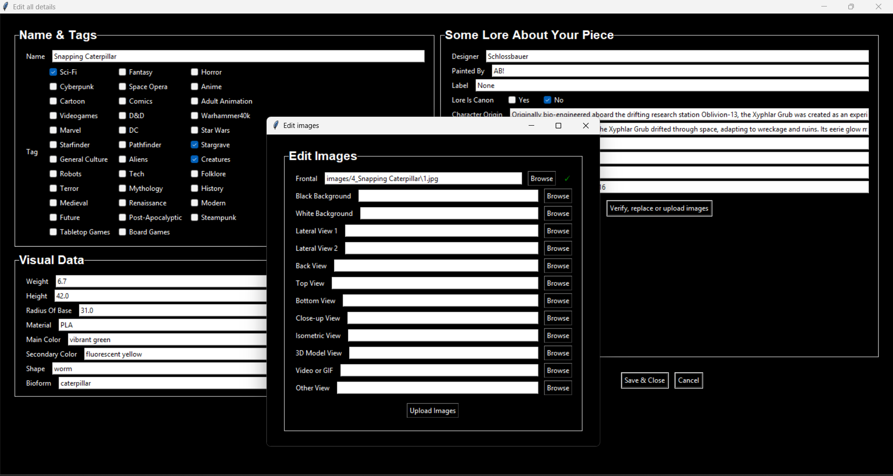

**Miniature Deletion**

The deletion module (deletion_module.py) currently only handles deleting the selected miniature from the database.

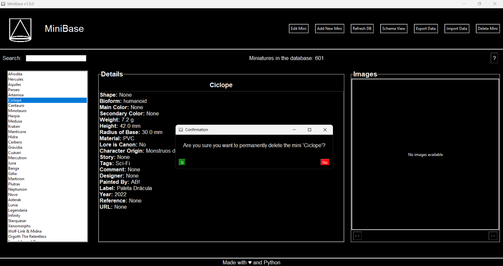
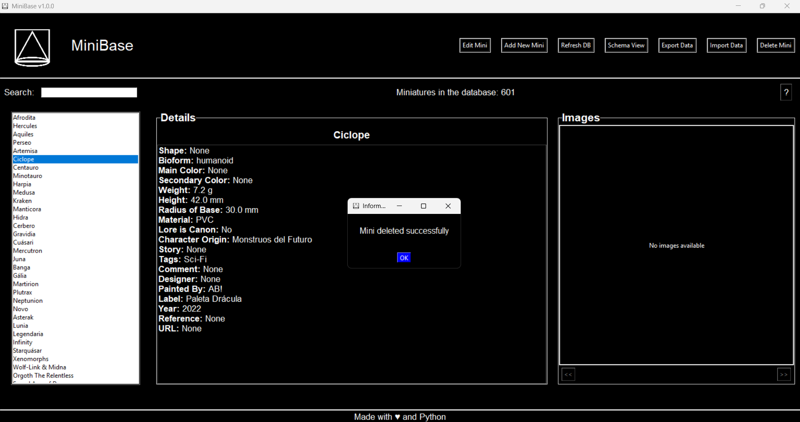

**Schema View**

Schema View Component: The schemaview_module.py allows visualization of the database tables created from the schema.sql file using the initialization module (initialize_db.py). It serves as a review tool to verify how data insertions are being made, the existing tables, and their relationships.

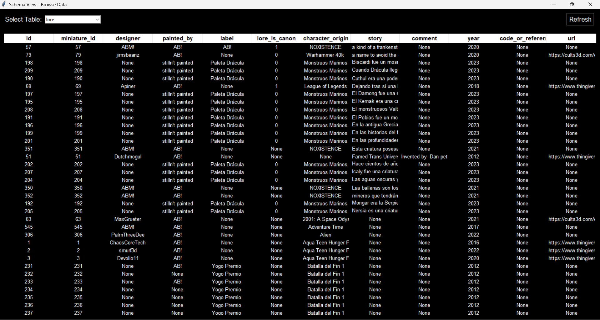

**Upcoming AI integrations for RPGs**

Although it does not currently include AI models, the project's structure is designed to facilitate the future integration of algorithms that can analyze, enrich, or generate dynamic content based on the characters in miniatures database. The next step in MiniBase's evolution is its integration with AI models to enhance its functionality. Some ideas include:

* Automatic Lore Generation: Using language models, the application could generate unique stories for each gaming table, including attributes, scenes, settings, characters, and much more based on the user's collection.

* Narrative Assistants: AI could act as a game master assistant, suggesting events, dialogues, or challenges based on the selected miniatures. Additionally, with Computer Vision, it could recognize the scenery and miniatures in real time.

*  Behavior Simulation: Miniature data could feed real-time simulations, allowing characters to interact in RPG environments where the system could act as the game master or an interactive ruleset.

MiniBase is designed not only to be a useful tool for maintaining miniature collections but also to serve as a platform with immense potential to enrich gaming and narrative experiences. Through the integration of LLM for creation and storytelling, as well as Computer Vision models to further enhance RPG dynamics, MiniBase acts as a bridge between traditional organization and the endless possibilities of modern technology.
