Tecnologías: JavaScript, CSS, HTML, Three.js & Tensorflow.js
* **[ Aqui el repositorio del proyecto](https://github.com/blackars/NOXISTENCE-PortalsGarden)**
 

Visita y explora la experiencia compelta en:**[Portals Garden](https://portalsgarden.netlify.app)**

 

 

# **Portals Garden**
 

_Al interior de NOXISTENCE, existen espacios donde florecen muchos otros lugares y pueden ser encontrados caminos a existencias complejas atrapadas en este limbo. Estos jardines no son puntos aislados pues resulta evidente que les une algo, son caminos a todo lo que la inexistencia aquí captura, pero también son en si mismos senderos que develan de a poco los secretos que aquí se esconden._ 
 

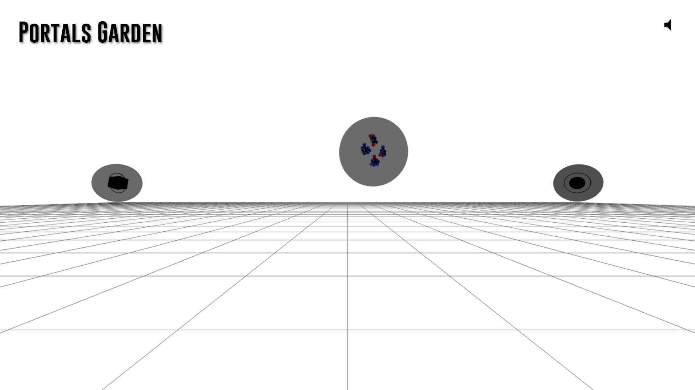
 

Portals Garden 001, es el primer cumulo de experiencias relacionadas al universo narrativo que introduzco en el anterior blog;**[ _"About NOXISTENCE"_](https://blackars.com/blog/post2)**. En este jardín de portales se comienza a explorar las historias detrás de parajes, criaturas y tantas otras cosas propias del lore es este universo. 

una primera puesta en escena y extensión de mi universo de ficción y sus  posibilidades narrativas transmedia valiéndome de la web, usando JavaScript, CSS y HTML vainilla de la mano de Three.js como framework principal junto a ciertas funcionalidades con Tensorflow.js. Para crear las experiencias que no buscan solo ser juegos sino también espacios de creación y expresión, rincones de arte para explorar y reflexionar, un total de 9 que conoceremos a continuación.
 

**ADVERTENCIA: CONTIENE ALGUNOS SPOILERS** 
 

## **Portals Garden**
 

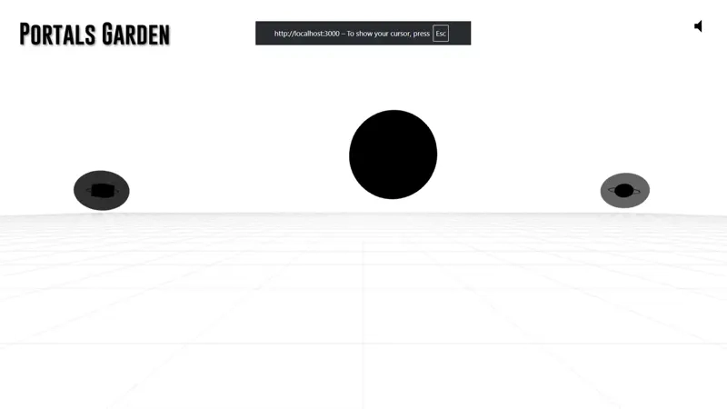
 

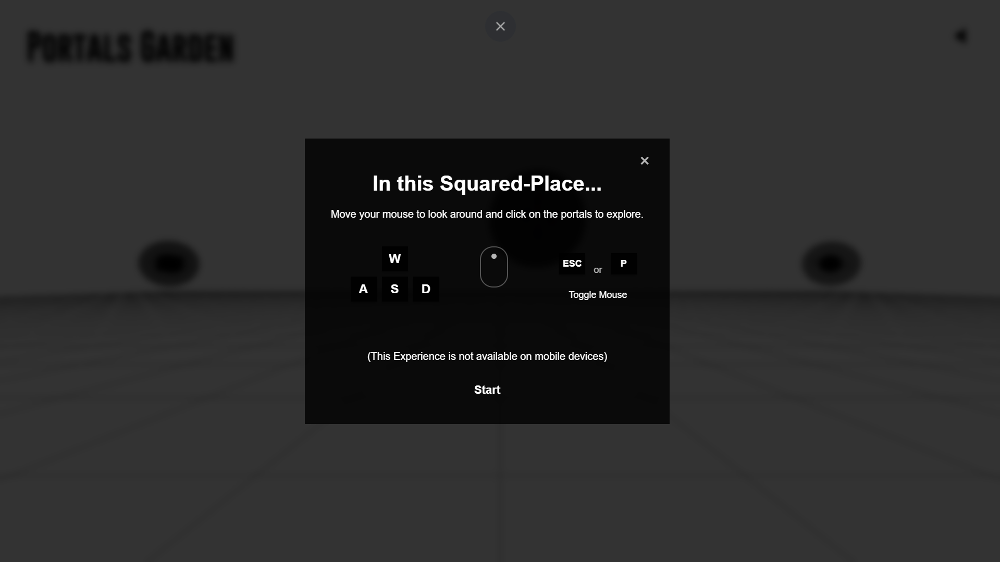
 

El jardín de portales #1, nos muestra un poco de como se da la interacción para ingresar a las experiencias que aquí florecen.
 

## **Clean Squared Place**
 

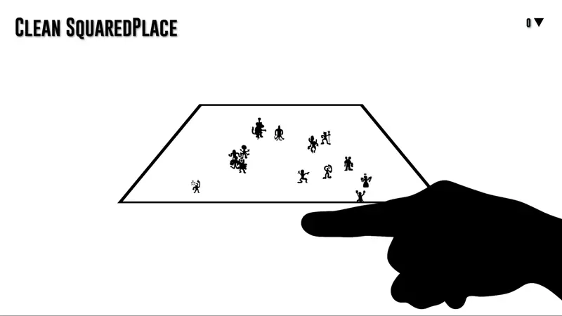
 

Esta experiencia es la unica que no es en 3D. Consiste en despejar el Squared Place de las entidades atrapadas en el. Al completarse se obtiene un patrón para desbloquear otra experiencia: 
 

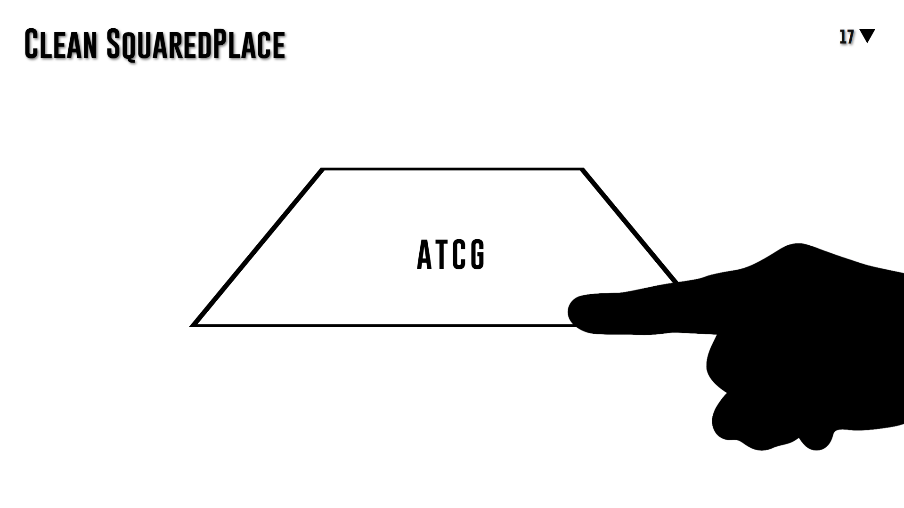
 

# **Nitrogenous Bases**
 

Una vez ingresado el código de acceso llegamos al ordenador molecular de bases nitrogenadas, en esta experiencia con drag and drop, organizamos las moléculas en uno de los 5 patrones correspondientes a cada una de las experiencias que se ocultan en el código de la vida.
 

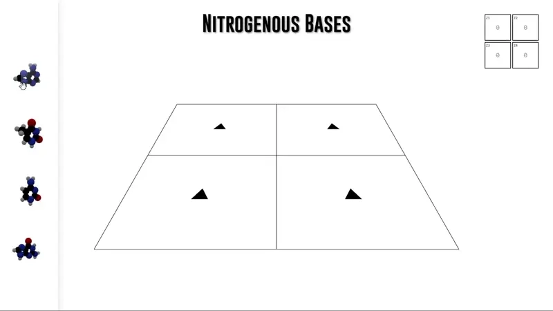
 

# **Game Of Life**
 

Esta experiencia no te llevara mas allá de ella misma, ¿o tal vez si? El tradicional juego de la vida de John Horton Conway, es reinterpretado en 3D con la estética de mi preferencia para ofrecer un espacio de experimentación simple, de reflexión a través de lo que se visualiza y se interpreta desde estas formas simples que nos apelan a algo tan complejo como la vida. 
 

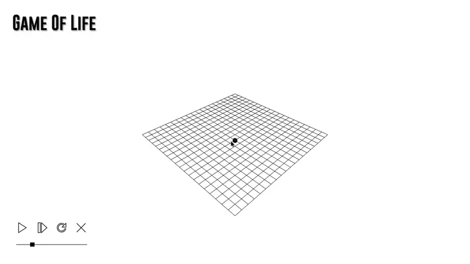
 

# **AnothEarth**
 

Este es el portal principal del que se hilaran todas las experiencias y websites relacionadas con el universo de AnothEarth, actualmente enlaza únicamente a la sección del lore correspondiente en el website principal de NOXISTENCE
 

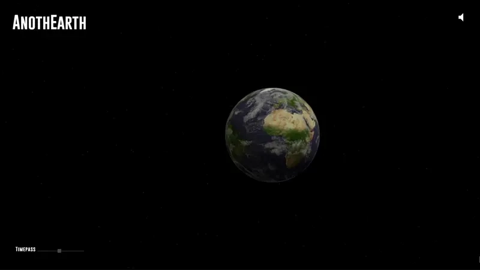
 

# **Maxkodia Planet**
 
Esta experiencia funciona de forma similar sino idéntica a AntohEarth. 
 

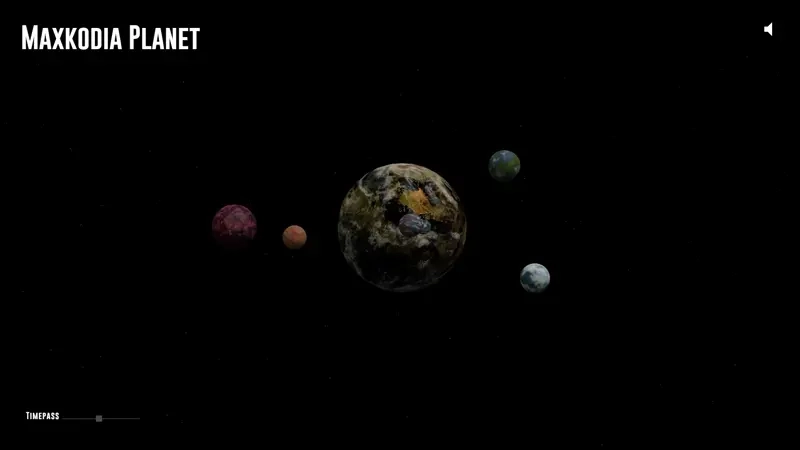
 

# **Space Words**
 

En esta experiencia exploramos un poco de lo que una mirada al espacio capturada en NOXISTENCE tiene para decirnos sobre su captor. 
 

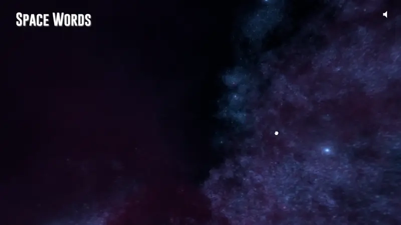
 

# **Deep Space Encounter**
 

En esta experiencia nos enfrentamos a uno de los peligros del espacio para al borde de la muerte entender y encarar el poder de un circulo… 
 

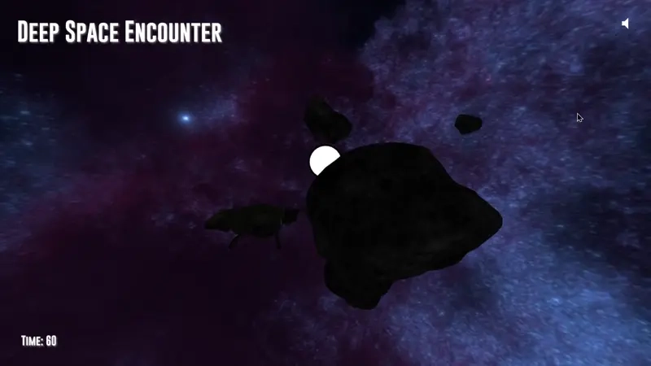
 

# **Gardhan Thinker**
 

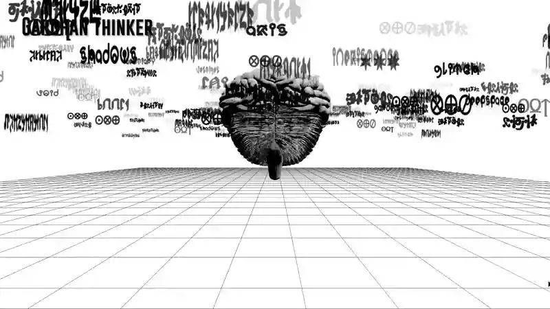
 

Aquí conocemos a un pensador de la especie Gardhan, atrapados entre sus pensamientos podemos interactuar con esta mente para abrir una experiencia que ya comienza a llevarnos a un rincon oscuro de NOXISTENCE…
 

# **Human Thinker**
 

 

Aquí yace un pensador humano, en un limbo de conceptos, ideas y visiones de una realidad difícil de comprender, ¿Qué tiene para revelarnos la mente humana?

 