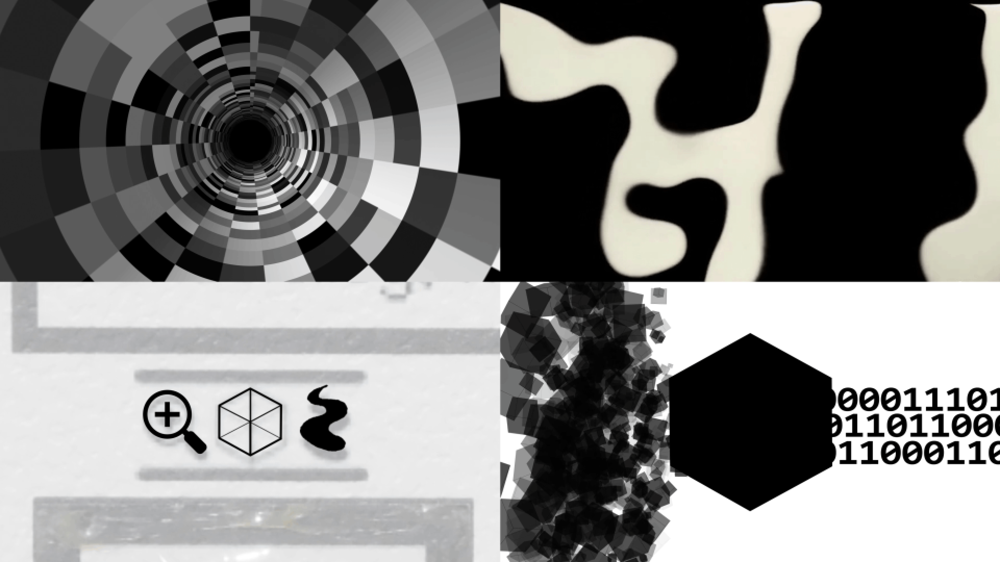
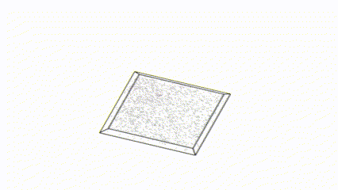

**About the Creation into Process of the Installation**

The installation Artificial Mind: Prototype 1 is the result of the undergraduate thesis project titled: A/R/Tography Between the Arts and Computer Sciences: The Proposal of a Research and Creation Approach on Technologies from the Visual Arts Degree at Universidad del Valle. This is an effort to A/R/Tograph the initiative to promote mastery and understand how relationships with technological tools develop in artistic processes, starting from the individual interested in the phenomenon and extending to the immediate context that largely shapes the researcher.

This research need, born within the Visual Arts Degree program, stems from its students, teachers, and graduates, aiming to comprehend the various ways technological tools can be utilized and, above all, to understand how they are assimilated at a time when attention is focused on the rapid development of fields like Artificial Intelligence and its transformative potential across all areas of human life.

From a need for creation fueled by the immediate context and its challenges in developing Artificial Intelligence, an initiative emerges and a document is developed that explores all these aspects through related references. This effort positions us within the Technological Phenomenon, where many avant-garde artists, aided by contemporary technological tools, contribute to shaping the vision of a futuristic aesthetic—an aesthetic where light becomes the medium for painting and data the material for sculpting.

As individuals become ensnared in the vast volume of this data, they are reduced to ones and zeros, black and white, point and line on an abstract volumetric plane of immense technical complexity, both in understanding and execution. This transforms this type of production into an ongoing endeavor that constantly iterates upon the knowledge accumulated throughout the process.
The three pieces of this installation correspond to the chapter structure of the research, while also addressing the need to gradually advance in the investigative processes of the A/R/Tographer and the way new media integrate with all aspects of artistic creation. This represents an initial approach to future AI models, moving toward a new paradigm of the sensory.

* **Piece 1 - Self-Portrait with Mapping:** A work assembled with miniatures that represents the creator's mind, evolving over the years with the integration of electronic components and animated projections. It reflects the artist's identity and their relationship with personal data.

A photo of the self-portrait without the video projection.

* **Piece 2 - Video Art on Screens:** An experimental audiovisual projection displayed on a matrix of LCD monitors, created from data, images, and animations generated through digital processing. It is an abstraction of the research, devoid of interactivity and trapped within the digital realm.

Some key frames of the experimetal short films. Can you see the full video  

* **Piece 3 - Interactive Mapping:** An installation featuring video mapping and a webcam that responds to audience interaction. It represents a particle system where each element symbolizes data collected in the research, exploring surveillance and the visual reinterpretation of information.

 

The interactive video projection that moves in the direction of the movement detected by a camera.

En esta tres piezas se usan solo algunos de los elementos visuales obtenidos tras el "encriptado creativo" que se hace de los datos-para salbaguardar estos- y experiencias durante la enseñanza de los procesos, todo este material, se fue utilizando entre piezas, experimentando una y otra vez con esas cuestiones esenciales que eran reducidas a conceptos minimos para con ellos crear, esconder entre un lenguaje propio las piezas de un rompecabezas que se contruye poco a poco con cada experimento que me aproxima cada vez mas a herramientas de vangardia para desdibujar los limites entre la praxis artistica y las ciencias de la computacion.