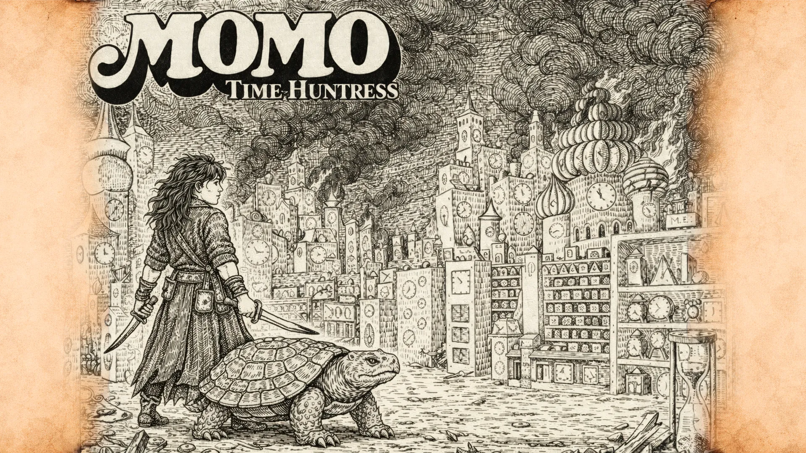

---
layout: ../../layouts/LayoutBlogPost.astro
title: "VN Momo: Time-Huntress"
description: "An interactive visual novel that fuses modern science fiction with dark fantasy. Built in Ren'Py, follow Momo and Cassiopeia chase time‑thieves."
abstract: "A poetic narrative experience where a scarred huntress seeks vengeance against anomalies that devoured her world. Immerse yourself in hand-drawn visuals, cinematic cutscenes, and a philosophical exploration of time, loss, and the price of redemption."
pubDate: 2026-02-16
category: "software"
id: "3"
image: "/momo-cover.webp"
slug: "momotimehuntress"

---

Technologies: Ren'Py, Python, WebP, OGG Vorbis, WebM  
* <a href="https://blackars.itch.io/momo-time-huntress" target="_blank" rel="noopener noreferrer"><strong>→ Play now on itch.io ←</strong></a>  
* <a href="https://github.com/blackars/momo-time-huntress" target="_blank" rel="noopener noreferrer"><strong>→ Click here to view the code repository ←</strong></a>  
 

 

# **Momo: Time-Huntress**
 

_Within a world where time fractures and shadows arrive before their owners, Momo and her mysterious companion Cassiopeia cross enchanted forests toward a ruined castle._  
 

In a world where time fractures and shadows arrive before their owners, Momo and her mysterious companion Cassiopeia cross enchanted forests toward a ruined castle. Amid echoes of voices that resound seconds before being spoken, and the ticking of a city that never slept, a huntress seeks vengeance against the Grey Gentlemen — the anomaly that devoured her world second by second.

*"They erased my world. I will erase them in return."*
 

**Momo: Time-Huntress** is an interactive visual novel that fuses modern science fiction, dark fantasy, and the philosophy of time. Built on the Ren'Py engine, this work departs from the conventional tropes of the genre to offer a narrative experience where poetic prose and atmosphere carry profound emotional and symbolic weight.

Between ruins swallowed by moss, rivers that hide their scent from pattern-tracking predators, and a castle that pulses with stolen seconds, Momo must confront not just the monsters that feed on time, but the truth of what they are — and what they've awakened.
 

# **Characters**
 

**Momo** — *The last huntress of a consumed world.* Fierce, scarred, and relentless. She carries the weight of a reality already erased by the Grey Gentlemen. She speaks to Cassiopeia as if reading her silence, finds beauty in ruins, and sharpens her grief into a blade.

**Cassiopeia** — *A silent presence that speaks in symbols.* She never speaks — but Momo understands every silence. She traces mysterious symbols in the air, feels vibrations before anomalies arrive, and seems to know more than she lets on.

**The Grey Gentlemen Anomaly** — *They do not hunt like beasts. They calculate.* Beings from beyond reality that consume time itself. Each arrival leaves a crater. Each word is a distorted echo. They claim to be searching for something more powerful — or fleeing from it.
 

# **Features**
 

- **Full HD Visuals** — hand-drawn backgrounds and sprites at 1920x1080.
- **Cinematic Cutscenes** — embedded video sequences for key story moments.
- **Original Soundtrack** — ambient dark fantasy audio scoring.
- **Dialogue Choices** — branching narrative with meaningful decisions.
- **NVL Storytelling** — book-style narrative passages within the game.
- **Live2D-style Sprites** — multiple expressions and poses for each character.
 

# **Tech Stack**
 

| Layer | Technology |
|-------|-----------|
| Engine | Ren'Py 8.0+ |
| Resolution | 1920x1080 (Full HD) |
| Audio | OGG Vorbis (ambient & sfx) |
| Graphics | WebP sprites & backgrounds |
| Video | WebM embedded cutscenes |
| Scripting | Ren'Py `.rpy` (Python-based DSL) |
| Platforms | Windows / macOS / Linux / Android / Web |
 

# **More Than Just a Visual Novel**
 

*Momo: Time-Huntress* isn't only an exercise in narrative game design — it's the first fragment of a larger reflection on time, loss, and what consumes both. The Grey Gentlemen are not simple monsters; they are a symbol, a question dressed as an anomaly. This project opens the door to a mythology that will keep expanding across future works, exploring what happens when the invisible force that defines us becomes the enemy.
 

# **License**
 

All rights reserved © 2026 — Momo: Time-Huntress.

